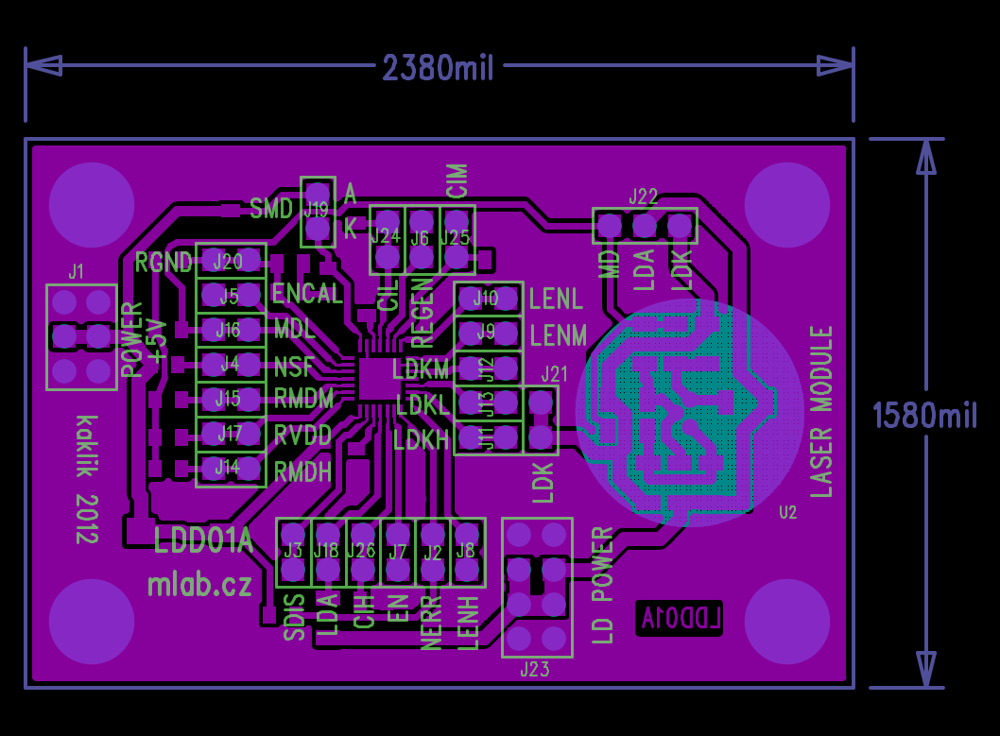

[Czech](./README.cs.md)
<!--- module --->
# LDD01A - Laser diode driver

Three-channel laser diode pulse regulator module enables the continuous wave operation of laser diodes spike-free switching with defined current pulses in a frequency range of up to 155 MHz. The three channels can be accumulatively pulsed and the peak optical power of the laser diode is regulated separately.
            
